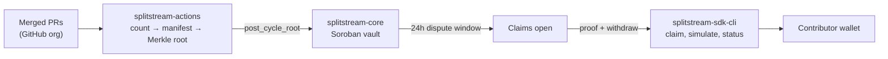

<p align="center">
  
</p>

# SplitStream

[](https://github.com/SplitStream-Labs/splitstream-core/actions/workflows/ci.yml)
[](https://splitstream-labs.github.io/splitstream-core/)
[](https://crates.io/crates/soroban-sdk)
[](https://stellar.expert/explorer/testnet/contract/CCC2LP2LOYZOLA2JW4C4K7JMR3TRJZIKHDSQYSFJ3R3MCDJLVBT3PZOC)
[](LICENSE)

**[📖 Documentation](https://splitstream-labs.github.io/splitstream-core/)** · [Testnet Explorer](https://stellar.expert/explorer/testnet/contract/CCC2LP2LOYZOLA2JW4C4K7JMR3TRJZIKHDSQYSFJ3R3MCDJLVBT3PZOC) · [Contributing](CONTRIBUTING.md) · [Security](SECURITY.md) · [Changelog](CHANGELOG.md)

**SplitStreamVault** is a Soroban smart contract that pools funds (a single
SEP-41 token per deployment — USDC or native XLM SAC) and settles them to
contributors via three strategies:

1. **Merkle-proof claims** — Cycle-based points payouts. The oracle posts a
   payout-manifest root per cycle; after a 24-hour dispute window contributors
   claim by proving a `(contributor, amount)` leaf against the root and are
   credited a pull-payment balance they withdraw themselves.
2. **Fixed basis-point waterfalls** — recurring team/community/reserve splits.
   The admin configures a share list summing to exactly 10,000 bps and the
   oracle (or admin, manually) triggers distributions.
3. **Linear vesting streams** — maintainer retention rewards, paid directly on
   claim.

The contract is pull-payment throughout: it never loops over an unbounded
contributor list in a single transaction.

> **Part of SplitStream** — this repo is one of three: **splitstream-core** (this
> repo, the Soroban vault contract that holds and settles the funds),
> [splitstream-actions](https://github.com/SplitStream-Labs/splitstream-actions)
> (the GitHub→chain bridge that computes each cycle's payout manifest and
> relays its Merkle root on-chain), and
> [splitstream-sdk-cli](https://github.com/SplitStream-Labs/splitstream-sdk-cli)
> (the client SDK and CLI contributors claim with and maintainers simulate and
> report with). All three are documented together on the
> **[unified docs site](https://splitstream-labs.github.io/splitstream-core/)**.

## How the pieces fit



The contract never knows about GitHub, points, or issue counts — it only
verifies `(address, amount)` pairs against a committed root and pays them. The
full cross-repo design is on the
[architecture page](https://splitstream-labs.github.io/splitstream-core/architecture/).

## The challenge-window mechanism

A posted cycle root is **not immediately claimable**. Maintainers have a fixed
24-hour window (`CHALLENGE_WINDOW_SECS = 86_400`) to catch a bad points
calculation and correct it on-chain, **once**, via
`challenge_and_replace_root` — before any contributor can extract funds against
it. Once the first claim succeeds, the root is final: replacement is rejected
after `claims_started` is set, and the window itself is bounded to 24h from the
original post (replacement never restarts it).

## Documentation

The **[unified docs site](https://splitstream-labs.github.io/splitstream-core/)**
merges the documentation of all three repos into one place, rebuilt from each
repo's `main` on every change:

| Section | Covers |
|---|---|
| [Overview & Architecture](https://splitstream-labs.github.io/splitstream-core/architecture/) | How the three repos fit together and the frozen cross-repo interfaces. |
| [splitstream-core](https://splitstream-labs.github.io/splitstream-core/core/introduction/) | Protocol mechanics, the full contract reference, maintainer operations, and the developer guide. |
| [splitstream-actions](https://splitstream-labs.github.io/splitstream-core/actions/introduction/) | The GitHub→chain bridge and the payout-manifest format. |
| [splitstream-sdk-cli](https://splitstream-labs.github.io/splitstream-core/sdk-cli/introduction/) | The SDK and CLI reference for contributors and maintainers. |

## Quick Start

Rust 1.91+ is required (the `wasm32v1-none` target). Pinned SDK:
`soroban-sdk = "27.0.6"` (latest stable; do not use release candidates).

```bash
# Tests (soroban-sdk testutils; no network needed)
cargo test --workspace

# Lint
cargo clippy --all-targets -- -D warnings

# Deployable wasm — build with stellar-cli, never `cargo build` for the crate
stellar contract build --package splitstream-vault
# artifact: target/wasm32v1-none/release/splitstream_vault.wasm (~20 KB)
```

CI (`.github/workflows/ci.yml`) runs `cargo check`, `cargo test`,
`cargo clippy -D warnings`, and `stellar contract build` on every push and PR
to `main`.

## Storage design

`Admin`, `Oracle`, `Token` live in **instance** storage (TTL bumped on every
admin-gated call). `CycleData`, `CycleClaimed`, `Balance`, `FixedShares`,
`Vesting` and `SweepRequest` live in **persistent** storage; every write
extends the entry TTL in the same call (`storage::bump_persistent`) — a missing
`extend_ttl` is the classic Soroban bug where accounting silently expires.

## Contract functions

| Function | Auth | Purpose |
|---|---|---|
| `initialize(admin, oracle, token)` | admin | One-time setup; stores admin/oracle/SEP-41 token. |
| `deposit(from, amount)` | from | Pulls `amount` of the token into the vault. |
| `post_cycle_root(cycle_id, root, total_amount)` | oracle | Posts a payout-manifest root; one post per cycle. |
| `challenge_and_replace_root(cycle_id, new_root, new_total_amount)` | admin | Replaces the root within the dispute window (once). |
| `credit_claim(contributor, cycle_id, amount, proof)` | contributor | Verifies the Merkle proof and credits the claimable balance. |
| `withdraw(contributor)` | contributor | Pays out the claimable balance (checks-effects-interactions). |
| `configure_fixed_shares(shares)` | admin | Sets the bps split list (must sum to 10_000). |
| `distribute_fixed(amount)` | oracle | Credits each recipient `amount * bps / 10_000`. |
| `admin_distribute_fixed(amount)` | admin | Manual distribution; same body/events as `distribute_fixed`. |
| `create_vesting(contributor, total, duration_ledgers)` | admin | Creates/re-creates a linear vesting schedule (preserves `claimed`). |
| `claim_vested(contributor)` | contributor | Claims newly vested tokens, transferring them directly. |
| `request_sweep(to, amount)` | admin | Registers a sweep request, starting the 72h timelock. |
| `execute_sweep()` | admin | Executes the sweep once the timelock has elapsed. |
| `cancel_sweep()` | admin | Clears a pending sweep request (idempotent). |
| `get_balance(contributor)` / `get_cycle_info(cycle_id)` / `has_claimed(cycle_id, contributor)` / `get_vesting(contributor)` / `get_fixed_shares()` | — | Read-only views. |

The [contract reference](https://splitstream-labs.github.io/splitstream-core/core/contract-reference/)
documents every parameter, event, and error discriminant.

## Deployed — Testnet

| | |
|---|---|
| Vault contract | `CCC2LP2LOYZOLA2JW4C4K7JMR3TRJZIKHDSQYSFJ3R3MCDJLVBT3PZOC` |
| Token contract | `CDLZFC3SYJYDZT7K67VZ75HPJVIEUVNIXF47ZG2FB2RMQQVU2HHGCYSC` (native SAC) |
| Explorer | https://stellar.expert/explorer/testnet/contract/CCC2LP2LOYZOLA2JW4C4K7JMR3TRJZIKHDSQYSFJ3R3MCDJLVBT3PZOC |
| Network | Test SDF Network ; September 2015 (Testnet) |

## Repository layout

```
contracts/vault/src/
├── lib.rs         # #[contract] + #[contractimpl] entry points
├── storage.rs     # DataKey enum + typed get/set helpers with TTL bumps
├── types.rs       # CycleInfo, VestingData, SweepRequestData
├── errors.rs      # #[contracterror] SplitStreamError
├── merkle.rs      # leaf hashing + sorted-pair proof verification
├── claims.rs      # credit_claim, withdraw
├── fixed_split.rs # configure_fixed_shares, distribute_fixed, admin_distribute_fixed
├── vesting.rs     # create_vesting, claim_vested
├── sweep.rs       # request/execute/cancel sweep
└── test.rs        # one test module per feature

docs/              # this repo's documentation (merged into the unified site)
docs-hub/          # landing page + cross-repo architecture page for the site
scripts/           # assemble_docs.py — merges the three repos' docs for MkDocs
```

## Design decisions & known deviations

These are deliberate, documented decisions (each noted in its commit message):

- **`SweepRequest` is persistent, not temporary.** Temporary entries have a
  Mainnet max TTL of 17,280 ledgers (~1 day), shorter than the 72-hour sweep
  timelock — a request there would expire before it could execute.
- **`distribute_fixed` is split into two auth-gated functions.** SDK 27
  removed `current_contract_invoker` (the caller-introspection API) in the
  22.x auth rework, and a failed `require_auth` aborts the invocation, so an
  "admin OR oracle" check cannot be expressed in one function. `distribute_fixed`
  is oracle-gated (the automated trigger); `admin_distribute_fixed` is the
  admin-gated manual twin. Both delegate to one shared internal body, so they
  can never drift.
- **`claim_vested` with no schedule returns `NoVestingSchedule`** (error 17) —
  a dedicated variant so downstream SDKs can distinguish "no schedule" from
  "no balance".
- **Event topic names are full `Symbol`s** (e.g. `"claim_credited"`,
  `"cycle_root_replaced"`) via the (deprecated-but-supported)
  `Events::publish` API, preserving the frozen topic names from the spec.

## Contributing

Contributions are welcome — see [CONTRIBUTING.md](CONTRIBUTING.md) for the
build/test workflow and PR expectations, and [SECURITY.md](SECURITY.md) for
the security model and responsible-disclosure process. Found a bug or have a
feature idea? [Open an issue](https://github.com/SplitStream-Labs/splitstream-core/issues/new/choose).

## Contributors

[](https://github.com/SplitStream-Labs/splitstream-core/graphs/contributors)

## Community

- 💬 **GitHub Issues** — bug reports, feature requests, and design discussion
- 🔒 **Security** — report vulnerabilities privately per [SECURITY.md](SECURITY.md)

## Socials

- 🗨️ **Discord** — https://discord.gg/DzSUheDtQ
- 📢 **Telegram** — https://t.me/+zOMeL6fD6uY1ODhk

## Maintainers

<table>
  <tr>
    <td align="center">
      <a href="https://github.com/Oyinkans0la12">
        
      </a>
      <br />
      <strong>Oyinkans0la12</strong>
      <br />
      Smart Contract Engineer
      <br />
      <a href="https://github.com/Oyinkans0la12">GitHub</a>
    </td>
    <td align="left">
      <strong>Contact</strong>
      <br />
      <a href="https://github.com/SplitStream-Labs/splitstream-core/issues">GitHub Issues</a> — primary channel for bugs, feature requests, and design discussion
      <br />
      🔒 For vulnerabilities, use a <a href="https://github.com/SplitStream-Labs/splitstream-core/security/advisories/new">private security advisory</a> per SECURITY.md
    </td>
  </tr>
</table>

## License

This project is licensed under the MIT License — see [LICENSE](./LICENSE) for details.

[splitstream-actions]: https://github.com/SplitStream-Labs/splitstream-actions
[splitstream-sdk-cli]: https://github.com/SplitStream-Labs/splitstream-sdk-cli
