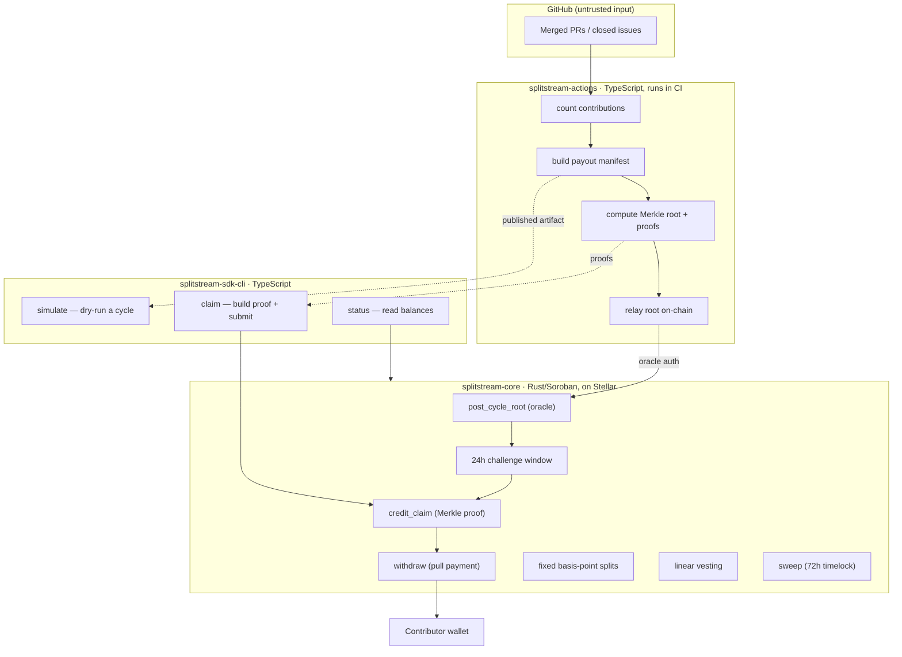

# Architecture

SplitStream is deliberately split into three repositories so that the thing
that **decides who is owed what** is separate from the thing that **holds the
money**, which is separate again from the thing that **lets each person
collect**. None of them trusts the others with more than it must.



## Component responsibilities

| Repository | Owns | Trust boundary |
|---|---|---|
| `splitstream-core` | Custody of the pooled SEP-41 token, the Merkle root of record, the dispute window, fixed-share splits, vesting schedules, and sweeps. | Trusts only that the admin and oracle behave; funds can never leave except through a valid proof or an admin-gated, timelocked sweep. |
| `splitstream-actions` | Reading GitHub events, weighting contributions, producing the payout manifest, and relaying its root on-chain. | Runs with the **oracle** key. It can post a wrong root, but that root is challengeable for 24 hours before any money moves. |
| `splitstream-sdk-cli` | A typed client over the vault: building Merkle proofs, submitting claims, reading balances, and simulating cycles before they are posted. | Holds only the contributor's own key. It can do nothing a contributor could not do by calling the contract directly. |

## The frozen cross-repo contracts

Three interfaces cross repository boundaries. They are protocol, not
implementation details, and changing any of them is a breaking change that
must land in all three repos together.

1. **The Merkle leaf format.** `splitstream-actions` and `splitstream-core`
   must hash a leaf identically, or proofs will never verify:

   ```
   sha256(contributor.to_xdr(env) ++ amount.to_xdr(env))
   ```

   Proofs use the sorted-pair convention (each pair hashed in ascending byte
   order), so left/right ordering never matters. The format is frozen in
   [`splitstream-core`'s CONTRIBUTING.md](https://github.com/SplitStream-Labs/splitstream-core/blob/main/CONTRIBUTING.md),
   and covered by golden fixtures in both repositories.

2. **The payout manifest schema.** The JSON artifact that
   `splitstream-actions` publishes and `splitstream-sdk-cli` consumes and
   verifies. Described once, in
   [Manifest reference](actions/manifest-reference.md).

3. **The contract ABI.** The 19 public functions and the 17 error
   discriminants of `splitstream-core` are addressed by name and number from
   both the SDK and the relay. Error numbers must never be renumbered — see
   [Contract reference](core/contract-reference.md).

## Lifecycle of a cycle

1. The action runs on a schedule (or on demand). It counts contributions from
   merged PRs and closed issues since the last cycle.
2. It computes each contributor's share, builds the manifest, and derives the
   Merkle root.
3. It relays the root to `splitstream-core` via `post_cycle_root`, signed with
   the oracle key. The 24-hour challenge window starts now.
4. Maintainers can inspect the manifest and, if it is wrong,
   `challenge_and_replace_root` **once** inside the window. The window never
   restarts.
5. After the window closes, claims open. A contributor (or their CI) obtains
   their proof from the manifest and calls `credit_claim`, which credits a
   pull-payment balance, then `withdraw` to receive the tokens.
6. Separately, the admin configures fixed basis-point splits and vesting
   schedules for recurring team payouts; those are not gated by the challenge
   window. Treasury sweeps are gated by a 72-hour timelock instead.

## Why three repositories

- **Custody is separated from computation.** The contract that holds the money
  contains no GitHub-specific logic, so the surface that must be audited is
  small and stable.
- **The oracle is not the admin.** `splitstream-actions` holds the oracle key
  and can post roots; it cannot replace them, configure splits, or sweep. The
  admin can replace a root, but only inside a bounded window.
- **Contributors can verify everything themselves.** With the manifest and the
  SDK, a contributor can reproduce their proof and confirm the on-chain root
  without trusting any server.
