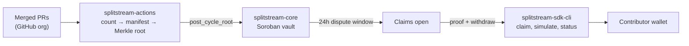

---
hide:
  - navigation
  - toc
---

  

# SplitStream

**On-chain treasury settlement for open source teams.** SplitStream turns a
pooled treasury into a verifiable, disputable, per-contributor payout — instead
of manual off-chain calculation. It is made of three repositories, documented
together here.

-   :material-shield-lock-outline:{ .lg .middle } __splitstream-core__

    ---

    The Soroban vault contract that holds the funds and enforces the rules:
    Merkle-proof claims, fixed basis-point splits, linear vesting, and a
    24-hour challenge window before any payout unlocks.

    [:octicons-arrow-right-24: Introduction](core/introduction.md)

-   :material-source-branch:{ .lg .middle } __splitstream-actions__

    ---

    The GitHub Action that turns merged PRs across an org into a signed payout
    manifest — counting what contributors closed and relaying the settlement
    root on-chain.

    [:octicons-arrow-right-24: Introduction](actions/introduction.md)

-   :material-console-line:{ .lg .middle } __splitstream-sdk-cli__

    ---

    The client SDK and CLI contributors claim with, and maintainers simulate,
    report, and reconcile with — a typed client over the vault contract.

    [:octicons-arrow-right-24: Introduction](sdk-cli/introduction.md)

## How the pieces fit

The contract never knows about GitHub, points, or issue counts — it only
verifies `(address, amount)` pairs against a committed root and pays them.
Everything that decides *what* a contributor is owed happens in
`splitstream-actions`; everything that lets a contributor *collect* happens
through `splitstream-sdk-cli`.

[:octicons-arrow-right-24: Read the cross-repo architecture](architecture.md)

## Start here

| I want to… | Go to |
|---|---|
| Understand the protocol end to end | [Architecture](architecture.md) |
| Read the contract's 19 public functions and 17 errors | [Contract reference](core/contract-reference.md) |
| See a cycle lifecycle with a worked numeric example | [Protocol mechanics](core/protocol-mechanics.md) |
| Configure the GitHub Action for my org | [For maintainers (actions)](actions/for-maintainers.md) |
| Claim a payout as a contributor | [For contributors (sdk-cli)](sdk-cli/for-contributors.md) |
| Build, test, and deploy any of the three repos | [Developer guides](core/developer-guide.md) |

## Source repositories

| Repository | Language | Role |
|---|---|---|
| [`splitstream-core`](https://github.com/SplitStream-Labs/splitstream-core) | Rust / Soroban | Vault contract — settlement and custody |
| [`splitstream-actions`](https://github.com/SplitStream-Labs/splitstream-actions) | TypeScript | GitHub→chain bridge — manifest + root relay |
| [`splitstream-sdk-cli`](https://github.com/SplitStream-Labs/splitstream-sdk-cli) | TypeScript | Client SDK + CLI — claim and operate |

!!! warning "Pre-audit software"
    The vault has **not** been independently audited. It is appropriate for
    Testnet and controlled Mainnet use with amounts you can afford to lose —
    see [`SECURITY.md`](https://github.com/SplitStream-Labs/splitstream-core/blob/main/SECURITY.md)
    and the threat model in each repository before moving real funds.
